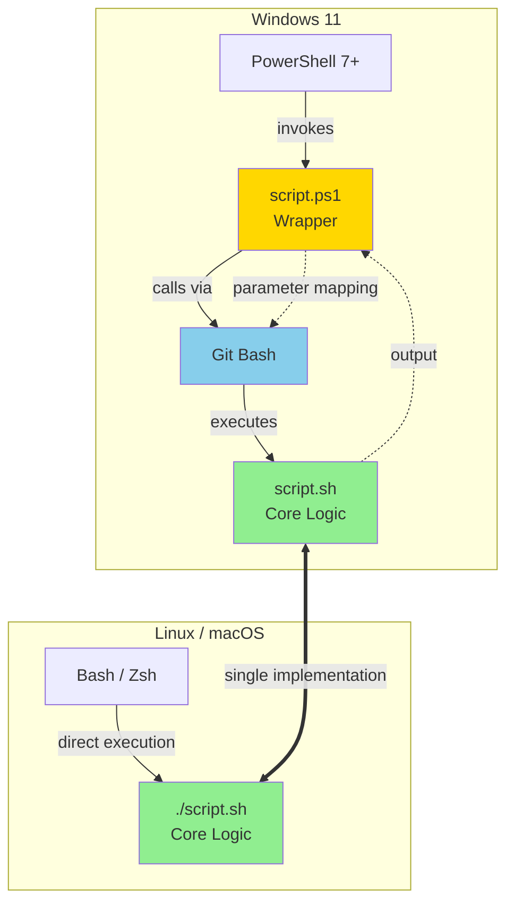
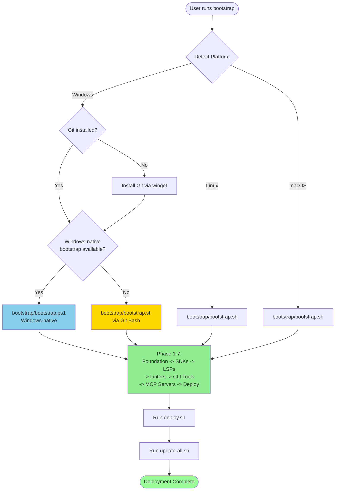
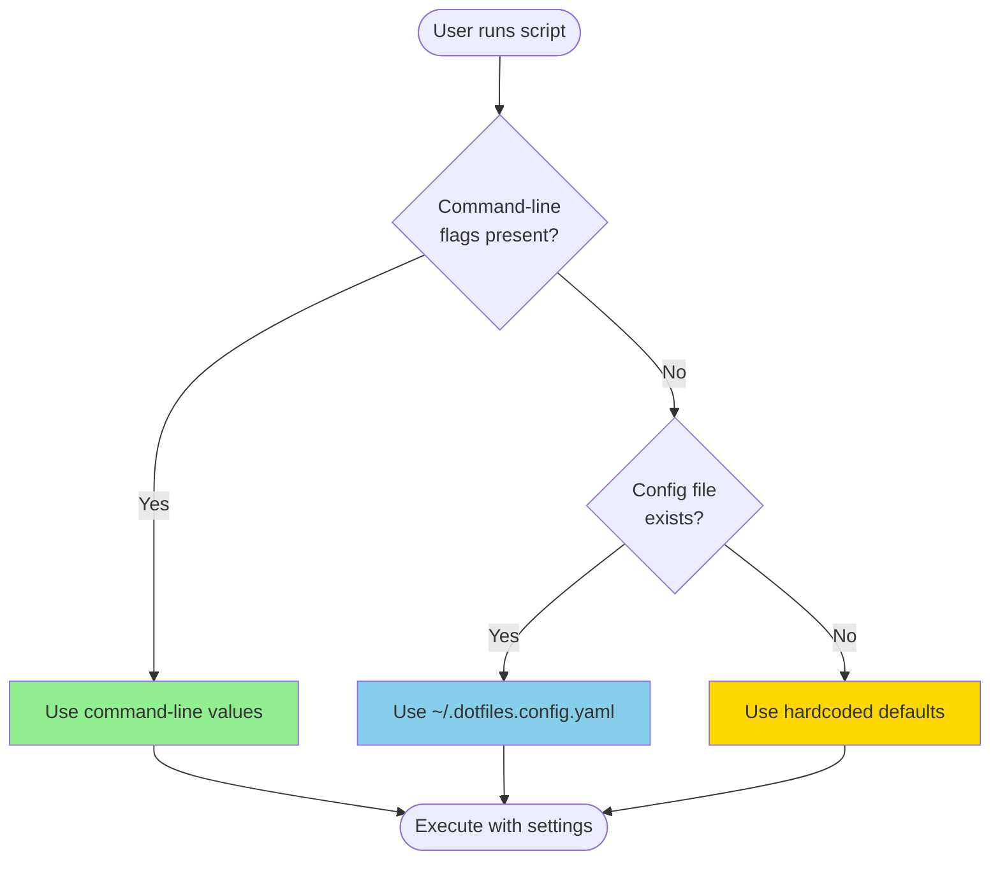
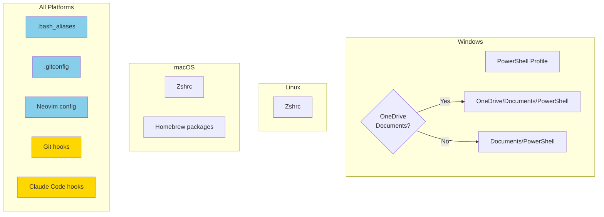
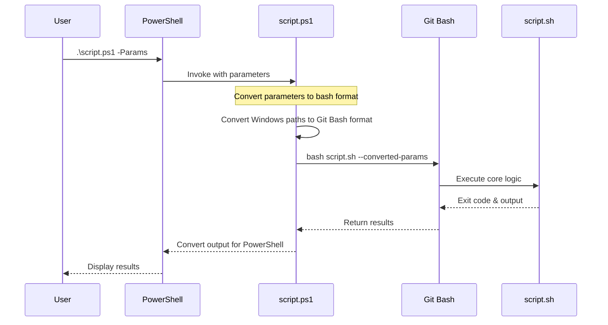

# Architecture

Technical architecture of the dotfiles system.

## Core Principle

**.sh scripts are the single source of truth.** All core logic lives in bash scripts (*.sh).

**.ps1 scripts are thin compatibility wrappers.** On Windows, PowerShell scripts invoke their .sh counterparts via Git Bash, providing a native Windows experience while maintaining a single implementation.

**Exception:** `bootstrap.ps1` has a Windows-native bootstrap (`bootstrap/bootstrap.ps1`) invoked first on Windows for better platform integration.

## System Architecture

## Bootstrap Flow

## Configuration Priority

## Platform-Specific Deployment

## Script Execution Flow (Windows)

## Benefits

- Single implementation to maintain and test
- .sh scripts work natively on Linux/macOS and via Git Bash on Windows
- .ps1 wrappers provide Windows convenience with familiar parameter names
- All features develop in .sh first, then automatically available on Windows
- Windows-native bootstrap provides better platform integration

## Line Endings

The repository uses `.gitattributes` to enforce LF line endings for shell scripts and CRLF for PowerShell scripts. Git is configured during bootstrap to maintain these conventions.

## Git Installation (Windows)

On Windows, Git (including Git Bash) is automatically installed via winget during bootstrap. No manual installation required.
