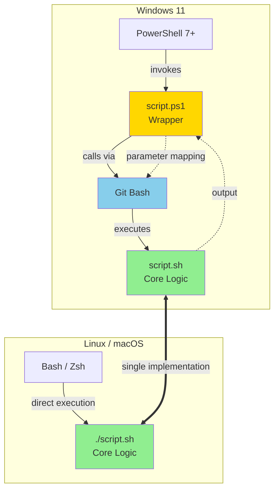
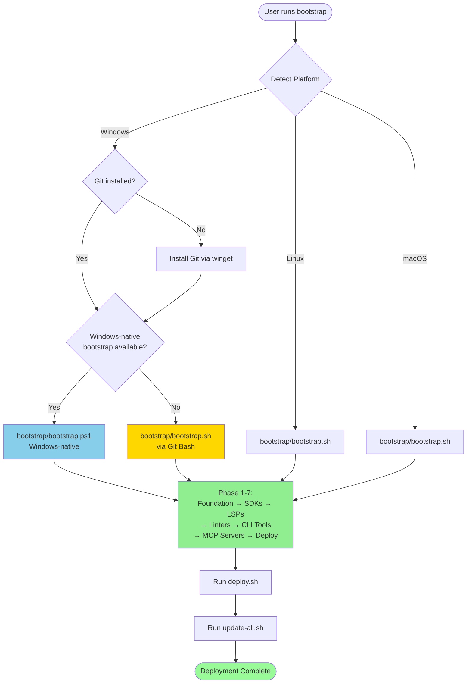
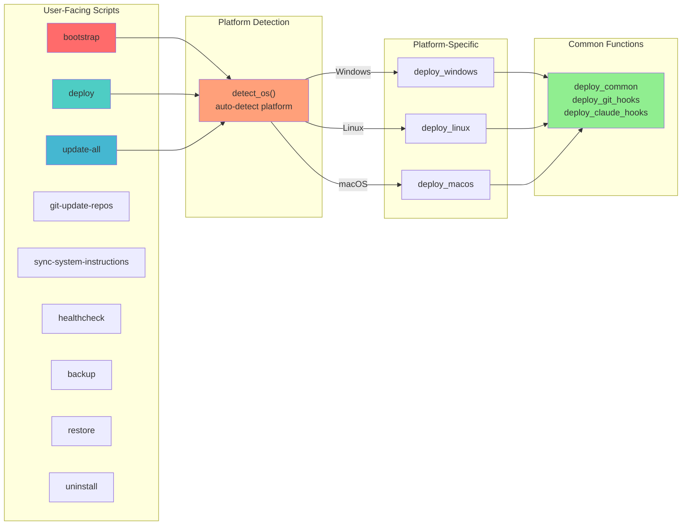
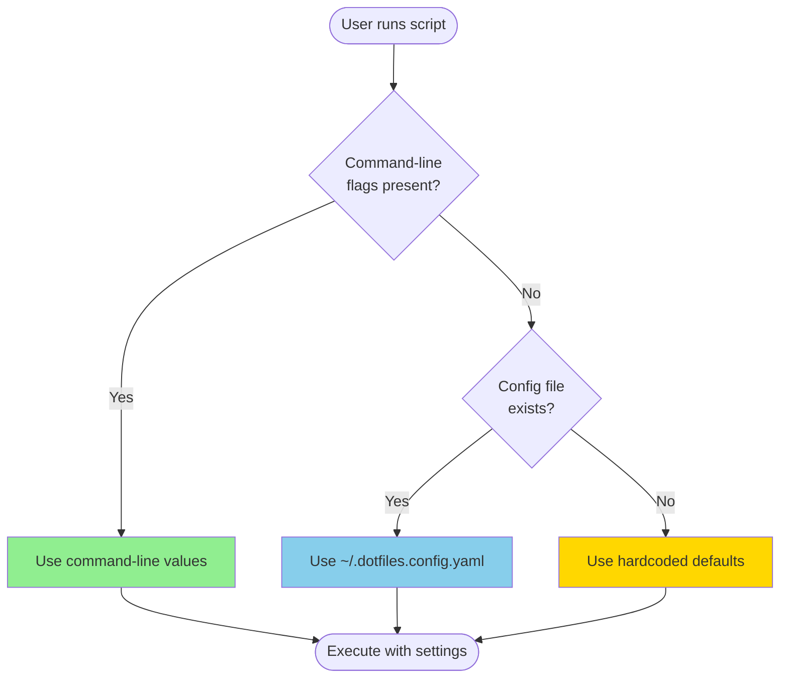
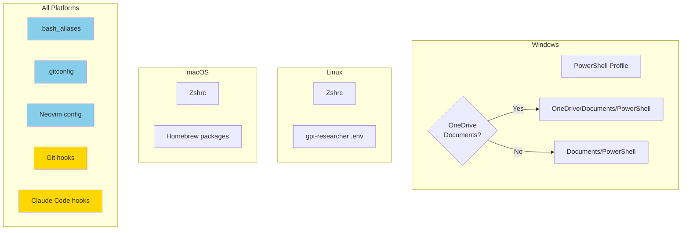
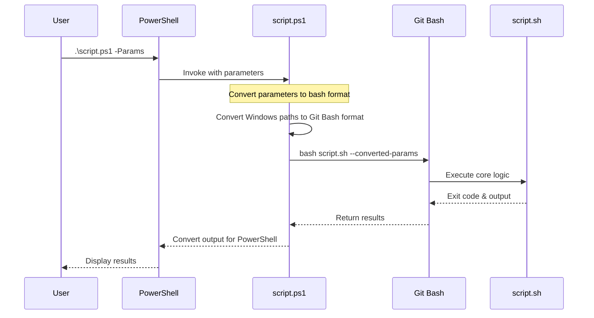

# Universal Dotfiles

 [](https://github.com/lavantien/dotfiles#security) [](https://opensource.org/licenses/MIT)
[](https://github.com/lavantien/dotfiles)

Production-grade dotfiles supporting Windows 11, Linux (Ubuntu/Fedora/Arch), and macOS with intelligent auto-detection and graceful fallbacks. A fully vibecoding-enabled dotfiles with complete AI-assisted development support: **23 LSP servers**, **40+ tools** (formatters, linters, testers), TDD enforcement, comprehensive Git hooks, and Claude Code integration. All configured, tested, and just clone and run.

## Table of Contents

- [1. Core Features](#1-core-features)
- [2. Idempotency Note](#2-idempotency-note)
- [3. Quick Start](#3-quick-start)
- [4. Bridge Approach Note](#4-bridge-approach-note)
- [5. Architecture Note](#5-architecture-note)
- [6. Bootstrap Options](#6-bootstrap-options)
- [7. Configuration (Optional)](#7-configuration-optional)
- [8. Git Hooks](#8-git-hooks)
- [9. Claude Code Integration](#9-claude-code-integration)
- [10. Universal Update All](#10-universal-update-all)
- [11. System Instructions Sync](#11-system-instructions-sync)
- [12. Health Check & Troubleshooting](#12-health-check--troubleshooting)
- [13. Testing](#13-testing)
- [14. Code Coverage](#14-code-coverage)
- [15. Security](#15-security)
- [16. Updating](#16-updating)
- [17. Shell Aliases](#17-shell-aliases)
- [18. Neovim Keybindings](#18-neovim-keybindings)
- [19. Legacy Museum](#19-legacy-museum)
- [20. Additional Documentation](#20-additional-documentation)

---

## 1. Core Features

Cross-Platform Support
- Windows 11: Native PowerShell 7+ support
- Linux: Ubuntu, Fedora, Arch, openSUSE
- macOS: Intel and Apple Silicon

Intelligent Automation
- Auto-detection: Detects platform, tools, and project types automatically
- Graceful fallbacks: Works even when some tools are not installed
- OneDrive-aware: Handles synced Documents folders on Windows
- Always latest: Bootstrap installs/updates all tools to latest versions

### What Gets Installed

**Package Managers**
- Windows: Scoop (CLI tools), winget (heavy apps like Visual Studio, LLVM)
- Linux: System (apt/dnf/pacman/zypper), Homebrew (optional)
- macOS: Homebrew (primary)

**C/C++ Toolchain**
- Windows: Visual Studio Community (latest), LLVM (latest)
- Linux: GCC (latest), LLVM/Clang (latest)
- macOS: LLVM/Clang (latest)

**Core SDKs** (always latest)
- Node.js LTS
- Python 3.x
- Go
- Rust (via rustup)
- dotnet LTS
- OpenJDK LTS

**Language Servers** (Neovim LSP + Claude Code - 23 servers)
- bashls (Bash/Shell)
- clangd (C/C++)
- csharp-ls (C#)
- docker-language-server (Dockerfile)
- docker-compose-language-server (Docker Compose)
- gopls (Go)
- html (HTML)
- cssls (CSS/SCSS/SASS)
- intelephense (PHP)
- jdtls (Java)
- lua-language-server (Lua)
- metals (Scala)
- powershell_es (PowerShell)
- pyright (Python)
- rust-analyzer (Rust)
- svelte (Svelte)
- tinymist (Typst)
- tombi (TOML)
- ts_ls (JavaScript/TypeScript)
- yaml-language-server (YAML)
- dartls (Dart - optional, requires Dart SDK)

**Complete Language Tool Matrix**

| Language | LSP | Tester | Formatter | Linter | Type Check |
|----------|-----|--------|-----------|--------|------------|
| **Bash** | bashls | bats | shfmt | shellcheck | - |
| **PowerShell** | powershell_es | Pester | Invoke-Formatter | PSScriptAnalyzer | PSScriptAnalyzer |
| **Go** | gopls | go test | gofmt, goimports | golangci-lint | go vet |
| **Rust** | rust_analyzer | cargo test | rustfmt | clippy | cargo check |
| **Python** | pyright | pytest | ruff, black | ruff | mypy |
| **JavaScript/TypeScript** | ts_ls | jest | prettier | eslint | tsc |
| **HTML** | html | - | prettier | - | - |
| **CSS/SCSS/SASS** | cssls | - | prettier | stylelint | - |
| **Svelte** | svelte | - | prettier | - | svelte-check |
| **C/C++** | clangd | Catch2 | clang-format | clang-tidy, cppcheck | compiler |
| **C#** | csharp_ls | dotnet test | dotnet format | Roslyn analyzers | dotnet build |
| **Java** | jdtls | JUnit | checkstyle | checkstyle | javac |
| **PHP** | intelephense | php, PHPUnit | pint | PHPStan, Psalm | - |
| **Scala** | metals | ScalaTest | scalafmt | scalafix | scalac |
| **Lua** | lua_ls | busted | stylua | selene | - |
| **Typst** | tinymist | built-in | tinymist | tinymist | - |
| **Dockerfile** | docker_ls | - | - | hadolint | - |
| **YAML** | yamlls | - | prettier | yamllint | - |
| **TOML** | tombi | - | taplo | - | - |

**Linters & Formatters** (for Git Hooks + Claude Code)
- HTML: prettier
- CSS/SCSS/SASS: prettier, stylelint
- JS/TS/JSX/TSX: prettier, eslint, tsc
- Python: ruff (format + lint), black, isort, mypy, pytest
- Go: goimports, go fmt, golangci-lint, go vet
- Rust: cargo fmt, clippy, cargo check
- C/C++: clang-format, clang-tidy, cppcheck
- C#: dotnet format, dotnet build
- Java: checkstyle
- Bash: shellcheck, shfmt
- PowerShell: Invoke-Formatter, PSScriptAnalyzer
- PHP: php, composer, pint, PHPStan, Psalm
- Scala: scalafmt, scalafix
- Lua: stylua, selene, busted
- Svelte: prettier, svelte-check

**Essential CLI Tools**
- fzf - Fuzzy finder
- zoxide - Smart cd navigation
- bat - Better cat
- eza - Better ls
- lazygit - Terminal Git UI
- gh - GitHub CLI
- ripgrep (rg) - Fast grep
- fd - Fast find
- tokei - Code stats (full category)
- repomix - Pack repositories for AI exploration (full category)

**Testing & Coverage**
- bats - Bash testing
- busted - Lua testing
- pytest - Python testing
- Pester - PowerShell testing with coverage
- kcov - Bash coverage reports (universal)

**Claude Code MCP Servers** (auto-installed via npm for full category)
- context7 - Up-to-date library documentation and code examples
- playwright - Browser automation and E2E testing

Note: These MCP servers are installed globally via npm during bootstrap. For OpenCode AI CLI, they're configured in `~/.config/opencode/opencode.json`. For Claude Code, MCP servers are primarily managed via plugins (see Section 9).

### Installation Categories

| Category | What's Installed | Use Case |
|----------|------------------|----------|
| minimal | Package managers, git, CLI tools only | Quick setup |
| sdk | minimal + Node.js, Python, Go, Rust, dotnet, JDK | No LSPs |
| full | sdk + all LSPs + linters/formatters + MCP servers | Complete environment (default) |

### Quality Assurance

- Comprehensive automated tests covering all major components (PowerShell + Bash)
- **Conventional commits enforcement** via git commit-msg hook
- **Pre-commit hooks** that auto-format and lint for 16+ languages
- **Claude Code quality hooks** for real-time format/lint/type-check after file writes
- **TDD guard** to enforce test-driven development practices
- **23 LSP servers** configured in Neovim for IDE-like experience
- **Hook integrity tests** prevent regression (detect truncation, missing functions)
- Global CLAUDE.md deployed to ~/.claude/ for consistent AI coding practices
- MCP servers (context7, playwright, repomix) auto-installed globally via npm

---

[↑ Back to Top](#table-of-contents)

## 2. Idempotency Note

All scripts in this repository are idempotent. They intelligently detect what's already installed, compare versions, and only install or update tools that are missing or outdated. You can safely run any script multiple times without any harm.

**Example: Idempotent Bootstrap Run**

Here's a real example of running `bootstrap.ps1 -y` when all tools are already installed:

```
~\....\dotfiles  main  .\bootstrap.ps1 -y

==== Bootstrap Windows Development Environment ====

Options:
  Interactive: False
  Dry Run: False
  Categories: full
  Skip Update: False

[STEP] Ensuring development directories are in PATH...

==== Phase 1: Foundation ====

[STEP] Configuring git line endings (core.autocrlf=input)...
[INFO] Set core.autocrlf=input (LF normalization enabled)
[INFO] Repo .gitattributes will enforce line endings
[OK] Foundation complete

==== Phase 2: Core SDKs ====

[OK] SDKs installation complete

==== Phase 3: Language Servers ====

[OK] Language servers installation complete

==== Phase 4: Linters & Formatters ====

[INFO] Laravel Pint already installed
[INFO] PHPStan already installed
[INFO] Psalm already installed
[OK] Linters & formatters installation complete

==== Phase 5: CLI Tools ====

[OK] CLI tools installation complete

==== Phase 5.25: MCP Servers ====

[OK] MCP server installation complete

==== Phase 5.5: Development Tools ====

[OK] Development tools installation complete

==== Phase 6: Deploying Configurations ====

[STEP] Running deploy script...
[OK] Configurations deployed

==== Phase 7: Updating All Repositories and Packages ====

[STEP] Running update-all script...
[OK] Update complete

==== Bootstrap Summary ====

Installed: 0

Skipped: 75
  - git (version control)
  - scoop (package manager)
  - GitHub SSH key already in known_hosts
  - node (Node.js runtime)
  - python (Python runtime)
  - go (Go runtime)
  - rust (Rust toolchain)
  - dotnet (.NET SDK)
  - OpenJDK (Java development)
  - clangd (C/C++ LSP)
  - gopls (Go LSP)
  - rust-analyzer (Rust LSP)
  - pyright (Python LSP)
  - typescript-language-server (TypeScript LSP)
  - vscode-html-language-server (vscode-html-language-server)
  - vscode-css-language-server (vscode-css-language-server)
  - svelte-language-server (svelte-language-server)
  - bash-language-server (bash-language-server)
  - yaml-language-server (YAML LSP)
  - lua-language-server (Lua LSP)
  - csharp-ls (C# LSP)
  - jdtls (Java LSP)
  - intelephense (PHP LSP)
  - docker-langserver (Docker LSP)
  - tombi (TOML LSP)
  - tinymist (Nim LSP)
  - prettier (code formatter)
  - eslint (JavaScript linter)
  - stylelint (stylelint)
  - svelte-check (svelte-check)
  - repomix (repomix)
  - ruff (Python linter)
  - black (Python formatter)
  - isort (Python import sorter)
  - mypy (Python type checker)
  - pytest (pytest)
  - goimports (Go import organizer)
  - golangci-lint (Go linter)
  - shellcheck (Shell script analyzer)
  - shfmt (Shell script formatter)
  - cppcheck (cppcheck)
  - php (php)
  - composer (composer)
  - pint (PHP code style)
  - phpstan (PHP static analysis)
  - psalm (PHP static analysis)
  - coursier (JVM dependency manager)
  - scalafmt (Scala formatter)
  - coursier (JVM dependency manager)
  - scalafix (scalafix)
  - coursier (JVM dependency manager)
  - metals (metals)
  - stylua (stylua)
  - selene (selene)
  - fzf (fuzzy finder)
  - zoxide (smart directory navigation)
  - bat (enhanced cat)
  - eza (enhanced ls)
  - lazygit (Git TUI)
  - gh (GitHub CLI)
  - rg (text search)
  - fd (file finder)
  - tokei (code stats)
  - difft (diff viewer)
  - bats (Bash testing)
  - Pester (PowerShell testing)
  - context7-mcp (documentation lookup)
  - playwright-mcp (browser automation)
  - repomix (repository packer (uses npx -y repomix --mcp))
  - vscode (code editor)
  - visual-studio (full IDE)
  - llvm (C/C++ toolchain)
  - latex (document preparation)
  - claude-code (AI CLI)
  - opencode (AI CLI)

=== Bootstrap Complete ===
All tools are available in the current session.
For new shells, PATH has been updated automatically.
```

Notice how:
- **0 items were installed** - everything was already present
- **75 items were skipped** - detected as already installed
- **No redundant work** - each package checked once
- **Clean exit** - no errors, no warnings

This applies to all core scripts (.sh is source of truth, .ps1 is wrapper):
- bootstrap.sh / bootstrap.ps1
- deploy.sh / deploy.ps1
- update-all.sh / update-all.ps1
- git-update-repos.sh / git-update-repos.ps1
- sync-system-instructions.sh / sync-system-instructions.ps1
- backup.sh / backup.ps1
- restore.sh / restore.ps1
- healthcheck.sh / healthcheck.ps1
- uninstall.sh / uninstall.ps1

---

[↑ Back to Top](#table-of-contents)

## 3. Quick Start

Windows (PowerShell 7+)

```powershell
git clone https://github.com/lavantien/dotfiles.git $HOME/dev/dotfiles
cd $HOME/dev/dotfiles
.\bootstrap.ps1

# Git (including Git Bash) is auto-installed via winget during bootstrap
# No manual Git installation required

. $PROFILE
```

Linux / macOS

```bash
git clone https://github.com/lavantien/dotfiles.git ~/dev/dotfiles
cd ~/dev/dotfiles
chmod +x bootstrap.sh
./bootstrap.sh

exec zsh  # or source ~/.zshrc
```

Verify Installation

```bash
which n  # Should point to nvim
which lg  # Should point to lazygit

up  # or update
```

### Entry Point Scripts

All scripts work on Windows (PowerShell), Linux, and macOS (bash). Use `.ps1` on Windows, `.sh` on Linux/macOS.

| Script | Purpose |
|--------|---------|
| **bootstrap** / **bootstrap.ps1** | Initial setup - installs package managers, SDKs, LSPs, linters, CLI tools, and deploys configs |
| **deploy** / **deploy.ps1** | Deploy configuration files (Neovim, git hooks, shell aliases, Claude Code hooks) to home directory |
| **update-all** / **update-all.ps1** | Update all package managers and system packages (20+ package managers supported) |
| **git-update-repos** / **git-update-repos.ps1** | Clone/update ALL GitHub repos (public + private) via gh CLI, optionally sync system instructions |
| **sync-system-instructions** / **sync-system-instructions.ps1** | Sync AI system instructions (CLAUDE.md, AGENTS.md, GEMINI.md) to all repositories |
| **healthcheck** / **healthcheck.ps1** | Check system health - verify tools installed, configs in place, git hooks working |
| **backup** / **backup.ps1** | Create timestamped backup of dotfiles and configs before major changes |
| **restore** / **restore.ps1** | Restore from a previous backup (list backups with `--list-backups`) |
| **uninstall** / **uninstall.ps1** | Remove all deployed configs and clean up (keeps installed packages) |
| **tests/coverage.sh** / **tests/coverage-report.ps1** | Run test suite and generate coverage reports |

---

[↑ Back to Top](#table-of-contents)

## 4. Bridge Approach Note

This repository uses a bridge approach that maintains backward compatibility while supporting optional configuration.

Works perfectly without configuration:
- Run bootstrap scripts directly - they use hardcoded defaults (categories: full)
- Zero setup required
- Existing workflows unchanged

Optional configuration available:
- Create ~/.dotfiles.config.yaml from example file
- Customize settings like categories, editor, github_username, etc.
- Scripts auto-detect and use config if present

Priority: Command-line flags > Config file > Hardcoded defaults

For details: See BRIDGE.md and QUICKREF.md

---

[↑ Back to Top](#table-of-contents)

## 5. Architecture Note

**.sh scripts are the single source of truth.** All core logic lives in bash scripts (*.sh).

**.ps1 scripts are thin compatibility wrappers.** On Windows, PowerShell scripts invoke their .sh counterparts via Git Bash, providing a native Windows experience while maintaining a single implementation.

**Exception: bootstrap.ps1** - This wrapper has a Windows-native bootstrap (`bootstrap/bootstrap.ps1`) that is invoked first on Windows for better platform integration. It only falls back to the bash script if the Windows-native version is unavailable.

### System Architecture



### Bootstrap Flowchart



### Script Entry Points



### Configuration Priority



### Platform-Specific Deployment



### Script Execution Flow



**Benefits:**
- Single implementation to maintain and test
- .sh scripts work natively on Linux/macOS and via Git Bash on Windows
- .ps1 wrappers provide Windows convenience with familiar parameter names
- All features develop in .sh first, then automatically available on Windows
- Windows-native bootstrap provides better platform integration

**Line Endings:**
The repository uses `.gitattributes` to enforce LF line endings for shell scripts and CRLF for PowerShell scripts. Git is configured during bootstrap to maintain these conventions.

**Git Installation:**
On Windows, Git (including Git Bash) is automatically installed via winget during bootstrap. No manual installation required.

---

[↑ Back to Top](#table-of-contents)

## 6. Bootstrap Options

Installation Categories

| Category | Description |
|----------|-------------|
| minimal | Foundation (package managers, git) + CLI tools only |
| sdk | Minimal + programming language SDKs (Node, Python, Go, Rust) |
| full | SDK + language servers + linters/formatters (default) |

Command-Line Options

| Option | Bash | PowerShell | Default |
|--------|-------|-----------|---------|
| Non-interactive | -y, --yes | -Y | Prompt for confirmation |
| Dry-run | --dry-run | -DryRun | Install everything |
| Categories | --categories sdk | -Categories sdk | full |
| Skip update | --skip-update | -SkipUpdate | Update package managers |
| Verbose | --verbose | -VerboseMode | Show detailed output |
| Help | -h, --help | -Help | Show help |

**New Feature: Tool Descriptions**
The bootstrap summary now includes brief descriptions for each tool in parentheses, making it easier to understand what was installed:

```
Installed: 5
  - git (version control)
  - fzf (fuzzy finder)
  - ripgrep (text search)
  - bat (cat alternative)
  - lazygit (Git TUI)

Skipped: 2
  - node (Node.js runtime)
  - go (Go runtime)
```

Use `--verbose` / `-VerboseMode` to see details for all items including those that were already installed.

What Gets Installed

| Phase | Tools |
|-------|-------|
| 1: Foundation | Package managers (Homebrew, Scoop), git |
| 2: Core SDKs | Node.js, Python, Go, Rust, dotnet, OpenJDK |
| 3: Language Servers | clangd, gopls, rust-analyzer, pyright, ts_ls, html, cssls, svelte, bashls, intelephense, metals, yaml-language-server, lua-language-server, jdtls, csharp-ls, docker-ls, tombi, tinymist, powershell_es |
| 4: Linters & Formatters | prettier, eslint, stylelint, ruff, black, isort, mypy, pytest, goimports, golangci-lint, clang-format, clang-tidy, cppcheck, php, composer, pint, phpstan, psalm, shellcheck, shfmt, scalafmt, scalafix, stylua, selene, busted, checkstyle, svelte-check, repomix, PSScriptAnalyzer |
| 5: CLI Tools | fzf, zoxide, bat, eza, lazygit, gh, ripgrep, fd, tokei |
| 5.25: MCP Servers | context7-mcp, playwright-mcp (via npm) |
| 5.5: Development Tools | Additional CLI utilities |
| 6: Deploy Configs | Runs deploy.sh / deploy.ps1 to copy configurations (including git hooks, Claude Code hooks, Neovim config) |
| 7: Update All | Runs update-all.sh / update-all.ps1 to update packages and repos |

---

[↑ Back to Top](#table-of-contents)

## 7. Configuration (Optional)

Default Behavior (No Config Needed)

```powershell
.\bootstrap.ps1

# Uses hardcoded defaults:
# - Categories: "full"
# - Interactive: true
# - No configuration file required
```

Optional Customization

```bash
cp .dotfiles.config.yaml.example ~/.dotfiles.config.yaml
vim ~/.dotfiles.config.yaml

./bootstrap.sh  # Auto-detects config
```

Configuration Priority

1. Command-line flags (highest): --categories minimal
2. Config file (middle): ~/.dotfiles.config.yaml
3. Hardcoded defaults (lowest): Script defaults

Common Config Options

| Setting | Values | Default | Description |
|----------|---------|---------|-------------|
| categories | minimal, sdk, full | full | Installation size |
| editor | nvim, vim, code, nano | (none) | Preferred editor |
| theme | gruvbox-light, etc. | (none) | Default theme |
| github_username | your github username | lavantien | Git repo management |
| base_dir | path to git repos | ~/dev/github | Repository location |
| auto_commit_changes | true, false | false | Auto-commit synced files |

---

[↑ Back to Top](#table-of-contents)

## 8. Git Hooks

Supported Languages

| Language | Formatter | Linter | Type Check | LSP |
|----------|-----------|--------|------------|-----|
| HTML | prettier | - | - | html |
| CSS/SCSS/SASS | prettier | stylelint | - | cssls |
| Svelte | prettier | - | svelte-check | svelte |
| Go | gofmt, goimports | golangci-lint | go vet | gopls |
| Rust | cargo fmt | clippy | cargo check | rust_analyzer |
| C/C++ | clang-format | clang-tidy, cppcheck | compiler | clangd |
| JS/TS | Prettier | ESLint | tsc | ts_ls |
| Python | ruff, black | ruff | mypy | pyright |
| C# | dotnet format | Roslyn analyzers | dotnet build | csharp_ls |
| Java | checkstyle | checkstyle | javac | jdtls |
| PHP | Laravel Pint | PHPStan, Psalm | php, PHPUnit | intelephense |
| Bash | shfmt | shellcheck | - | bashls |
| PowerShell | Invoke-Formatter | PSScriptAnalyzer | PSScriptAnalyzer | powershell_es |
| Scala | scalafmt | scalafix | scalac | metals |
| Lua | stylua | selene | - | lua_ls |
| Typst | tinymist | tinymist | - | tinymist |

What Hooks Do

Pre-commit (runs automatically before git commit):
1. Runs formatter on staged files
2. Runs linter
3. Runs type checker (if applicable)
4. Re-stages any auto-fixed files

Commit-msg (validates commit messages):
- Enforces Conventional Commits format
- Validates types: feat, fix, docs, style, refactor, perf, test, build, ci, chore, revert

Valid Commit Messages

```
feat(auth): add OAuth2 login support
fix(api): resolve null pointer in user service
docs(readme): update installation instructions
refactor(core): extract payment logic to separate module
test(user): add unit tests for registration flow
```

Bypass Hooks (Emergency)

```bash
git commit --no-verify -m "wip: emergency fix"
```

---

[↑ Back to Top](#table-of-contents)

## 9. Claude Code Integration

First-class support for Claude Code with quality checks, TDD enforcement, and MCP server integration.

### Global CLAUDE.md

The deploy script automatically copies CLAUDE.md to ~/.claude/ for project-agnostic AI coding instructions:

- TDD workflow enforcement
- Tool usage guidelines (Repomix, Context7, Playwright)
- Context hygiene and compaction rules
- Parallel exploration with Task tool
- Language-specific pitfalls (CGO_ENABLED for Go, gen directory handling)

### MCP Server Integration

MCP (Model Context Protocol) servers extend AI coding tools with additional capabilities. The bootstrap script auto-installs these servers globally via npm:

| MCP | Purpose |
|-----|---------|
| context7 | Up-to-date library documentation and code examples |
| playwright | Browser automation and E2E testing |

**OpenCode AI CLI**: Configured in `~/.config/opencode/opencode.json` with smart merge on deploy - universal MCPs are added if missing while preserving your existing MCPs and credentials.

**Claude Code**: MCP servers are primarily managed via plugins (see plugin installation below). The `~/.claude.json` template is minimal (`{"mcpServers": {}}`) since plugins handle MCP integration.

#### Installing Claude Code Plugins

To install the full suite of Claude Code plugins, use the `/plugins` command in Claude Code:

**Step 1: Add Plugin Marketplaces**

```
/plugins
```

Then add these two marketplaces:
- `anthropics/claude-plugins-official`
- `yamadashy/repomix`

**Step 2: Install Plugins**

After adding the marketplaces, install the following plugins:

**From yamadashy/repomix marketplace:**
- `repomix` - Pack repositories for full-context AI exploration

**From anthropics/claude-plugins-official marketplace:**

**Language Server Plugins:**
- `typescript-lsp` - TypeScript/JavaScript language server
- `pyright-lsp` - Python language server (Pyright)
- `gopls-lsp` - Go language server
- `rust-analyzer-lsp` - Rust language server
- `clangd-lsp` - C/C++ language server (clangd)
- `csharp-lsp` - C# language server
- `jdtls-lsp` - Java language server (Eclipse JDT.LS)
- `lua-lsp` - Lua language server
- `php-lsp` - PHP language server (Intelephense)

**Development Workflow:**
- `feature-dev` - Comprehensive feature development with specialized agents
- `frontend-design` - Create distinctive, production-grade frontend interfaces
- `agent-sdk-dev` - Development kit for the Claude Agent SDK

**Code Review & Git:**
- `code-review` - Automated PR review with confidence-based scoring
- `pr-review-toolkit` - Comprehensive PR review agents (comments, tests, error handling, type design)
- `commit-commands` - Git commit workflows including commit, push, and PR creation

**MCP Integration:**
- `context7` - Up-to-date library documentation and code examples
- `playwright` - Browser automation and end-to-end testing

**Quality & Utilities:**
- `security-guidance` - Security reminder hook for potential issues
- `explanatory-output-style` - Educational insights about implementation choices
- `ralph-wiggum` - Interactive self-referential AI loops for iterative development

#### OpenCode Configuration Example

For OpenCode AI CLI, the deploy script creates/updates `~/.config/opencode/opencode.json`:

```json
{
  "$schema": "https://opencode.ai/config.json",
  "mcp": {
    "context7": {
      "type": "local",
      "command": ["cmd", "/c", "npx", "-y", "@upstash/context7-mcp"],
      "timeout": 30000
    },
    "playwright": {
      "type": "local",
      "command": ["cmd", "/c", "npx", "-y", "@playwright/mcp"],
      "timeout": 30000
    }
  }
}
```

The deploy script smart-merges this config - adding missing universal MCPs while preserving your existing MCPs and credentials.

Quality Check Hook

Automatically runs format/lint/type-check after any file write operation:

```json
// ~/.claude/settings.json (Linux/macOS)
// %USERPROFILE%\.claude\settings.json (Windows)
{
  "hooks": {
    "PostToolUse": [
      {
        "matcher": "Write|Edit|MultiEdit",
        "hooks": [
          {
            "type": "command",
            "command": "pwsh -NoProfile -ExecutionPolicy Bypass -File ~/.claude/quality-check.ps1"
          }
        ]
      }
    ]
  }
}
```

Quality Check Tools Used

Claude Code's quality check hook uses the same tools as the git hooks (see Section 8):

| Category | Tools |
|----------|-------|
| **Formatters** | prettier, ruff, black, isort, goimports, go fmt, cargo fmt, clang-format, dotnet format, checkstyle (via Gradle), shfmt, scalafmt, stylua, pint |
| **Linters** | eslint, stylelint, ruff, golangci-lint, clippy, clang-tidy, cppcheck, mypy, shellcheck, PHPStan, Psalm, selene, scalafix |
| **Type Checkers** | tsc, svelte-check, go vet, cargo check, mypy, dotnet build, javac |

The quality check automatically detects the file type and runs the appropriate tool. See Section 8 (Git Hooks) for the complete language-by-language breakdown.

TDD Guard

Enforces Test-Driven Development practices when working with Claude Code:
- Red-Green-Refactor cycle enforcement
- Prevents adding multiple tests at once
- Prevents over-implementation
- Ensures tests exist before implementation

The TDD guard instructions are located at .claude/tdd-guard/data/instructions.md.

Deploy Claude Code Hooks

```bash
# The deploy script automatically copies to:
# ~/.claude/ (Linux/macOS)
# %USERPROFILE%\.claude\ (Windows)
#
# - quality-check.ps1 (PostToolUse hook for format/lint/type-check)
# - CLAUDE.md (Global AI coding instructions)
# - tdd-guard/ (TDD enforcement instructions)

# Just add hooks configuration to your Claude Code settings.json:
# - For PostToolUse hook to run quality checks
```

### AI CLI Tools & Pricing

This dotfiles setup is optimized for multiple AI CLI tools. The system instructions, MCP servers, hooks, linters, formatters, and checkers work across all major agentic coding tools:

| Tool | System Instructions | MCP Config | Notes |
|------|---------------------|------------|-------|
| Claude Code | `CLAUDE.md` | Plugins | Anthropic's official CLI |
| OpenCode | `AGENTS.md` | `~/.config/opencode/opencode.json` | Works with GLM via `npx @z_ai/coding-helper` |
| CodexCLI | `AGENTS.md` | - | Alternative AI CLI |
| Factory Droid | `AGENTS.md` | - | Alternative AI CLI |
| Gemini CLI | `GEMINI.md` | - | Free rate-limited usage (Gemini 2.5 Pro & 2.5 Flash) |

#### Recommended: GLM Coding Max Plan

I use Claude Code with the **GLM Coding Max $288 plan** (first-timer + holiday season deals). This is the **best price-to-performance option** for Claude Code:

- **Comparable performance** to latest Sonnet/Opus level models
- **Better speed** than Anthropic's direct models
- **2400 prompts per 5-hour window** vs 800 on $200 Claude Max 20x plan
- **No weekly limit** - seemingly unlimited usage for a full day
- **2 parallel instances** supported
- **Much better deal** than Anthropic's Claude Max plans

OpenCode works out of the box with GLM (via `npx @z_ai/coding-helper`, just like Claude Code). It also provides generous free usage for promoted/experimental models year-round.

Gemini CLI offers rate-limited free usage of Gemini 2.5 Pro and 2.5 Flash.

All our system instructions setup, linters, formatters, checkers, and MCP integration (OpenCode via `opencode.json`, Claude Code via plugins) cover the best agentic coding tools available today.

---

[↑ Back to Top](#table-of-contents)

## 10. Universal Update All

One command to update everything on your system.

```bash
# Linux/macOS
up  # or: update

# Windows (PowerShell)
up  # or: update
```

Supported Package Managers (20+)

System Package Managers:
APT, DNF, Pacman, Zypper, Homebrew, Snap, Flatpak, Scoop, winget, Chocolatey

Language Package Managers:
npm, yarn, pnpm, gup/go, cargo, rustup, pip/pip3, poetry, dotnet, composer, tlmgr

---

[↑ Back to Top](#table-of-contents)

## 11. System Instructions Sync

Single source of truth for AI assistant instructions across all repositories.

Files Distributed

| File | Purpose |
|------|---------|
| CLAUDE.md | Claude Code project instructions |
| AGENTS.md | Agent-specific behavior instructions |
| GEMINI.md | Gemini-specific instructions |
| RULES.md | Master system prompt |

Git Repository Management

The `git-update-repos` script fetches ALL your GitHub repositories (public **and private**) and keeps them synchronized.

**Requirements:**
- GitHub CLI (`gh`) must be installed and authenticated (`gh auth login`)
- Bootstrap installs `gh` automatically

**How It Works:**
- Uses `gh repo list` to fetch ALL repos via authenticated API (not public API)
- Clones new repos that don't exist locally
- Updates existing repos via `git pull`
- Optionally syncs AI system instructions to all repos

```bash
# Bash / Linux/macOS - Update all repos in default directory (~/dev/github)
./git-update-repos.sh

# Specify custom base directory
./git-update-repos.sh -d ~/dev/github

# Skip syncing system instructions (just clone/update repos)
./git-update-repos.sh --no-sync

# Use SSH URLs instead of HTTPS
./git-update-repos.sh -s

# Windows PowerShell
.\git-update-repos.ps1
.\git-update-repos.ps1 -BaseDir "C:\Users\cariy\dev\github"
.\git-update-repos.ps1 -NoSync
.\git-update-repos.ps1 -UseSSH
```

**Parameters:**

| Bash | PowerShell | Default | Description |
|------|-----------|---------|-------------|
| `-d <dir>` | `-BaseDir <path>` | `~/dev/github` | Directory to store repos |
| `-s` | `-UseSSH` | HTTPS | Use SSH URLs for cloning |
| `--no-sync` | `-NoSync` | Sync enabled | Skip syncing system instructions |
| `-c` | `-Commit` | No commit | Auto-commit when syncing instructions |

**Note:** The `-u/--username` parameter is accepted but ignored. The script uses your authenticated `gh` identity, which is more secure and always returns your complete repository list (including private repos).

Standalone Sync

```bash
# Sync instructions to all repos
./sync-system-instructions.sh

# Sync + commit + push (for headless Claude Code)
./sync-system-instructions.sh -c -p

# Windows
.\sync-system-instructions.ps1 -Commit -Push
```

---

[↑ Back to Top](#table-of-contents)

## 12. Health Check & Troubleshooting

Health Check

```bash
# Run health check
./healthcheck.sh

# PowerShell
.\healthcheck.ps1

# With JSON output (for CI/CD)
./healthcheck.sh --format json
```

Quick Troubleshooting

| Issue | Solution |
|--------|----------|
| Git hooks not running | git config --global core.hooksPath ~/.config/git/hooks |
| PowerShell execution policy | Set-ExecutionPolicy -ExecutionPolicy RemoteSigned -Scope CurrentUser |
| Neovim plugins not installing | In Neovim run :PackUpdate |
| zoxide not jumping to directories | Use directories normally for a few days to let zoxide learn |

For detailed troubleshooting, see QUICKREF.md.

---

[↑ Back to Top](#table-of-contents)

## 13. Testing

Comprehensive test suite ensuring reliability across all platforms and components.

Test Coverage

| Suite | Tests | Description |
|-------|-------|-------------|
| PowerShell | 100+ | Wrapper validation, bootstrap, config, git hooks, E2E, regression, integration, hook integrity |
| Bash | 50+ | Unit tests for deploy, backup, restore, healthcheck, uninstall, sync, git-update, hook integrity |
| **Total** | **150+** | Cross-platform test coverage |

Test Areas Covered

- Bootstrap Process: Platform detection, package installation, idempotency, correct platform bootstrap invocation
- Configuration System: YAML parsing, defaults, platform-specific settings
- Deployment: File copying, backup behavior, OneDrive handling
- Git Hooks: Commit message validation (Conventional Commits), pre-commit formatting/linting
- New Tools: Tests verify each new tool is included in bootstrap scripts
- Update Scripts: Package manager detection, timeout handling, safety features
- Edge Cases: Error handling, missing dependencies, graceful failures
- Regression Tests: Pattern-based tests to prevent known bugs from returning
- Integration Tests: Isolated mock environments to verify actual runtime behavior

Running Tests

```bash
# PowerShell tests - all suites
cd tests/powershell
pwsh -NoProfile -File run-tests.ps1

# Run specific test suite
pwsh -NoProfile -File wrapper.Tests.ps1        # Pattern-based regression tests
pwsh -NoProfile -File bootstrap-integration.Tests.ps1  # Integration tests with mocks

# Bash tests (requires bats)
cd tests/bash
bats bootstrap_test.bats
bats git-hooks_test.bats
```

Test Philosophy

- Unit tests verify individual functions and components
- E2E tests validate real-world workflows in isolated environments
- Regression tests use pattern matching to prevent known bugs from returning
- Integration tests use mocked environments to verify runtime behavior without side effects
- Tests are self-contained and clean up after themselves
- All tests are deterministic and can run in any order

---

[↑ Back to Top](#table-of-contents)

## 14. Code Coverage

Universal coverage measurement using kcov for bash scripts and Pester for PowerShell scripts.

**kcov** (primary, universal) - Code coverage tool that works with bash scripts on all platforms.

**Pester** - PowerShell code coverage using AST-based analysis.

Coverage Tools

| Platform | Bash | PowerShell |
|----------|------|------------|
| Windows | kcov (via Docker) | Pester |
| Linux | kcov (native) | Pester |
| macOS | kcov (native) | Pester |

**Note**: kcov is used natively on Linux/macOS. On Windows, kcov runs via Docker for consistency.

Tool Installation (Automatic)

All coverage tools are automatically installed by the bootstrap scripts:

```bash
# Linux/macOS
./bootstrap.sh
# Installs: kcov, bats, and all dependencies

# Windows PowerShell
.\bootstrap.ps1
# Installs: kcov (Scoop), Pester, bats
```

Manual Installation

If needed, install manually:

```bash
# kcov (Linux)
sudo apt install kcov  # Ubuntu/Debian
sudo dnf install kcov  # Fedora

# kcov (macOS - may require compilation)
brew install kcov

# Verify installation
kcov --version
bats --version
```

Running Coverage Reports

```bash
# Universal script (all platforms)
./tests/coverage.sh

# Bash-only coverage via Docker (all platforms)
./tests/coverage-docker.sh

# Bash-only coverage native (Linux/macOS)
./tests/coverage-bash.sh

# PowerShell-only coverage
pwsh -NoProfile -File tests/powershell/coverage.ps1

# Windows - full report with README update
.\tests\coverage-report.ps1 -UpdateReadme
```

Coverage Output

The coverage scripts generate:

- `coverage.json` - Combined coverage data for CI/CD
- `coverage-badge.svg` - Dynamic badge for README
- `coverage/kcov/index.html` - Detailed HTML report (kcov coverage)

Badge Color Scale (7 Rainbow Colors)

| Coverage | Color |
|----------|-------|
| >= 89% | violet |
| >= 74% | indigo |
| >= 59% | blue |
| >= 44% | green |
| >= 29% | yellow |
| >= 15% | orange |
| < 15% | red |

Coverage Calculation

- **PowerShell**: Measured via Pester v5.7+ code coverage feature
- **Bash**: Measured via kcov (code coverage tool for bash scripts)
- **Combined**: Weighted average based on actual codebase distribution

---

[↑ Back to Top](#table-of-contents)

## 15. Security

This project follows security best practices for personal development automation tools.

### Security Posture

| Aspect | Status |
|--------|--------|
| **Last Review** | January 2026 |
| **Review Method** | Comprehensive code review (16 commits analyzed) |
| **Critical Vulnerabilities** | 0 |
| **High Severity Issues** | 0 |
| **Medium Severity Issues** | 0 |

### Security Design Principles

1. **No Privilege Escalation**
   - All scripts run with the user's own permissions
   - No setuid/setgid binaries
   - No privileged escalation patterns

2. **No Network Services**
   - These are local development tools only
   - No web servers, APIs, or network listeners
   - No remote code execution surfaces

3. **Minimal Attack Surface**
   - Scripts designed for manual execution by trusted users
   - No processing of untrusted external input
   - No automated execution with user-controlled parameters

4. **Transparent Operations**
   - All operations are visible and logged
   - No obfuscated code or hidden downloads
   - Package installations use trusted sources (Homebrew, Scoop, npm, etc.)

### Threat Model

**Out of Scope** (not applicable to personal dotfiles):
- Web application vulnerabilities (XSS, SQL injection, CSRF)
- Network service attacks
- Multi-user authentication/authorization
- Cross-tenant data isolation

**In Scope** (relevant concerns):
- Safe file operations (no accidental data loss)
- Secure credential handling (git config, SSH keys)
- Trusted package sources
- Idempotent operations (no unexpected side effects)

### Security Best Practices Implemented

| Practice | Implementation |
|----------|----------------|
| **Idempotent Operations** | All scripts can be safely rerun without side effects |
| **Backup Before Changes** | backup.sh creates restore points before modifications |
| **Hook Integrity Tests** | Pre-commit hooks verify their own integrity before running |
| **Line Ending Safety** | .gitattributes enforces correct line endings to prevent script corruption |
| **No Secrets in Repo** | No API keys, passwords, or tokens committed to git |
| **Trusted Package Sources** | All packages from official sources (Homebrew, Scoop, npm, pip, etc.) |
| **Path Validation** | Wrapper scripts convert paths safely between Windows and Unix formats |
| **Graceful Degradation** | Scripts fail safely when dependencies are missing |

### Wrapper Script Security

The `.ps1` wrapper scripts delegate to `.sh` scripts via Git Bash. The pattern used:

```powershell
# Convert Windows paths to Git Bash format
$scriptPath = $scriptDir -replace '^([A-Z]):', '/c$1' -replace '\\', '/'

# Map PowerShell parameters to bash equivalents
$mappedArgs = @()
# ... parameter mapping ...

# Execute via bash
$argList = $mappedArgs -join ' '
$bashArgs = @("-l", "-c", "./script.sh $argList")
& bash @bashArgs
```

**Security Considerations:**
- Wrappers are designed for local execution by the repository owner
- Parameters are configuration values (paths, usernames, flags) not untrusted user input
- No web-facing interfaces or automated execution with external parameters
- If an attacker can run these scripts, they already have equivalent access

### Known Limitations

1. **Parameter String Interpolation**: Wrapper scripts join arguments into a string for bash -c execution. While this is a code quality issue, it is not exploitable in practice because:
   - Scripts run with user's own permissions (no privilege escalation)
   - No untrusted input reaches these parameters
   - An attacker who can execute the scripts can already run arbitrary commands

2. **No Cryptographic Verification**: Package signatures are verified by package managers (Homebrew, Scoop, etc.), but this repository doesn't independently verify downloaded packages beyond what the package managers provide.

3. **Git Config Modifications**: The bootstrap script modifies .gitconfig to remove platform-specific credential helpers. This is intentional behavior for cross-platform compatibility.

### Reporting Security Issues

If you discover a legitimate security vulnerability (e.g., a path that allows untrusted input to reach script execution, or a dependency with a known CVE), please report it responsibly:

1. Check the threat model: Is this exploitable in a personal dotfiles context?
2. Verify impact: Does this lead to privilege escalation or data exposure beyond the user's own access?
3. Open an issue with the `security` label

**Note**: Theoretical vulnerabilities without realistic exploitation paths in a personal development environment may be closed as "wontfix".

---

[↑ Back to Top](#table-of-contents)

## 16. Updating

```bash
cd ~/dev/dotfiles  # or $HOME/dev/dotfiles on Windows
git pull

./bootstrap.sh  # or .\bootstrap.ps1 on Windows

source ~/.zshrc  # or . $PROFILE on Windows
```

---

[↑ Back to Top](#table-of-contents)

## 17. Shell Aliases

File Operations

| Alias | Command | Description |
|-------|---------|-------------|
| ls | eza -la ... | Detailed directory listing |
| df | difft | Difftastic diff |
| t | tokei | Code statistics |

Directory Navigation (Zoxide)

| Alias | Description |
|-------|-------------|
| z <pattern> | Jump to directory matching pattern (fuzzy match) |
| zi | Interactive directory selection with fzf |
| zd <filter> | Jump with partial filter, shows interactive if no match |

Git Aliases

| Alias | Command |
|-------|---------|
| gs | git status |
| gl | git log |
| glg | git log --graph |
| glf | git log --follow |
| gb | git branch |
| gd | git diff |
| ga | git add |
| gaa | git add . |
| gcm | git commit -m |
| gp | git push |
| gf | git fetch |
| gm | git merge |
| gc | git checkout |
| gcb | git checkout -b |
| gt | git tag |

Docker Aliases

| Alias | Command |
|-------|---------|
| d | docker |
| ds | docker start |
| dx | docker stop |
| dp | docker ps |
| dpa | docker ps -a |
| di | docker images |
| dl | docker logs |
| dlf | docker logs -f |
| dc | docker compose |
| dcp | docker compose ps |
| dcpa | docker compose ps -a |
| dcu | docker compose up |
| dcd | docker compose down |
| dcl | docker compose logs |
| dclf | docker compose logs -f |

Utility Aliases

| Alias | Description |
|-------|-------------|
| up / update | Update all packages |
| ep | Edit profile |
| rprof | Reload profile |

---

[↑ Back to Top](#table-of-contents)

## 18. Neovim Keybindings

Leader key is Space.

From init.lua:

| Keybinding | Mode | Action |
|------------|------|--------|
| - | Normal | Open parent directory (Oil) |
| `<leader>q` | Normal | Quit |
| `<leader>x` | Normal | Write and source config |
| `<leader>'` | Normal | Search forward (#) |
| `<leader>pt` | Normal | Toggle Typst preview |
| `<leader>ps` | Normal | Start Typst preview |
| `<leader>pc` | Normal | Close Typst preview |
| `<leader>;` | Normal | Typst preview pick |
| `<leader>b` | Normal | Format buffer (LSP) |
| `<leader>u` | Normal | Update plugins |
| `<leader>e` | Normal | Fuzzy find everywhere (FzfLua) |
| `<leader>n` | Normal | Fuzzy combine (FzfLua) |
| `<leader>/` | Normal | Grep in current buffer (FzfLua) |
| `<leader>z` | Normal | Live grep native (FzfLua) |
| `<leader>f` | Normal | Find files (FzfLua) |
| `<leader>h` | Normal | Help tags (FzfLua) |
| `<leader>k` | Normal | Keymaps (FzfLua) |
| `<leader>l` | Normal | Location list (FzfLua) |
| `<leader>m` | Normal | Marks (FzfLua) |
| `<leader>t` | Normal | Quickfix (FzfLua) |

Git Mappings (using FzfLua)

| Key | Action |
|-----|--------|
| `<leader>gf` | Git files |
| `<leader>gs` | Git status |
| `<leader>gd` | Git diff |
| `<leader>gh` | Git hunks |
| `<leader>gc` | Git commits |
| `<leader>gl` | Git blame |
| `<leader>gb` | Git branches |
| `<leader>gt` | Git tags |
| `<leader>gk` | Git stash |

LSP Mappings (using FzfLua)

| Key | Action |
|-----|--------|
| `<leader>\` | LSP finder (definitions, refs, implementations) |
| `<leader>dd` | Document diagnostics |
| `<leader>dw` | Workspace diagnostics |
| `<leader>,` | Incoming calls |
| `<leader>.` | Outgoing calls |
| `<leader>a` | Code actions |
| `<leader>s` | Document symbols |
| `<leader>w` | Workspace symbols |
| `<leader>r` | References |
| `<leader>i` | Implementations |
| `<leader>o` | Type definitions |
| `<leader>j` | Go to definition |
| `<leader>v` | Go to declaration |

---

[↑ Back to Top](#table-of-contents)

## 19. Legacy Museum

The following files and directories are kept in the repository for historical reference but are no longer actively used. They represent earlier approaches and tools that have been superseded by better alternatives or are now obsolete.

**Note**: These files remain in the repository but are not deployed or used by current scripts. They are preserved for reference purposes.

This repository has a **rich 3-year history** spanning from June 2023 to January 2026, evolving through multiple major iterations and architectural changes.

| File/Directory | First Commit | Last Commit | Era | Why Deprecated |
|----------------|--------------|-------------|-----|----------------|
| **git-clone-all.sh** | `7a17cb5` (2023-06-03) | `749d333` (2023-06-04) | **2023** | Superseded by `git-update-repos.sh` which handles both cloning and updating |
| **assets/** | `3435adb` (2023-06-17) | `5206cde` (2024-07-29) | **2023-2024** | Embedded wallpapers moved to Wezterm config; cheatsheets now maintained separately |
| **typos.toml** | `6bb44e6` (2024-06-10) | `ef8f83d` (2025-02-23) | **2024-2025** | Typos integration removed; spell checking now handled by LSPs |
| **update.sh** | `e06937e` (2025-02-26) | `dca651f` (2025-02-28) | **2025** | Superseded by modular `update-all.sh` supporting 20+ package managers |
| **.aider.conf.yml.example** | `eb3108b` (2025-03-01) | `2899ff7` (2025-03-01) | **2025** | Aider config now managed per-project; example no longer needed globally |
| **.aider.model.settings.yml** | `e06937e` (2025-02-26) | `db0afd9` (2025-03-02) | **2025** | Model settings now project-specific; global config deprecated |
| **.env.gpt-researcher** | `ccb4882` (2025-03-02) | `8dd11dc` (2025-03-02) | **2025** | Project-specific environment; moved to `~/dev/gpt-researcher/.env` |

### Notes on Legacy Files

**git-clone-all.sh** (2.5 years old)
- Based on a gist by Dave Gallant
- Used `gh repo list` and `gh repo clone` to mirror organizations
- Last update: `749d333` on June 4, 2023
- `git-update-repos.sh` provides better functionality with idempotent updates

**assets/** (3.5 MB, 1.5 years old)
- `Buddha-and-animals.png` - Wezterm background (added `5206cde`, July 29, 2024)
- `fantasy-forest-wallpaper.jpg` - Alternative background
- `tokyo-sunset.jpeg` - Alternative background (added `eae3d48`, July 29, 2024)
- First wallpapers embedded: `3435adb` on June 17, 2023
- These were embedded directly in the repo before Wezterm switched to system paths

**typos.toml** (8 months old)
- Custom words: "noice" (Neovim plugin), "nd" (common typo)
- Created: `6bb44e6` on June 10, 2024
- Last update: `ef8f83d` on Feb 23, 2025 (Ubuntu 24.10 refactor)

**update.sh** (10 months old)
- Early update script for system packages
- Created: `e06937e` on Feb 26, 2025
- Last commit: `dca651f` on Feb 28, 2025
- Superseded by modular `update-all.sh` supporting 20+ package managers

**Aider Configuration** (10 months old)
- Aider is an AI pair programming tool that edits local repos
- `.aider.conf.yml.example`: Created `eb3108b`, last updated `2899ff7` (March 1, 2025)
- `.aider.model.settings.yml`: Created `e06937e`, last updated `db0afd9` (March 2, 2025)
- The example config showed how to use o3-mini and Claude 3.7 Sonnet
- Project-specific configuration is now preferred over global settings

**gpt-researcher** (10 months old)
- AI research assistant that automates web research tasks
- Environment file contained API keys and model preferences
- Created: `ccb4882` / `8dd11dc` on March 2, 2025
- Now deployed as part of the Linux-specific bootstrap to `~/dev/gpt-researcher/`

---

[↑ Back to Top](#table-of-contents)

## 20. Additional Documentation

| Document | Purpose |
|----------|---------|
| QUICKREF.md | Quick reference card and common tasks |
| BRIDGE.md | Bridge approach and configuration system |
| FIX_SUMMARY.md | What was fixed and why |
| COMPLETION_SUMMARY.md | Complete verification summary |

## License

MIT
